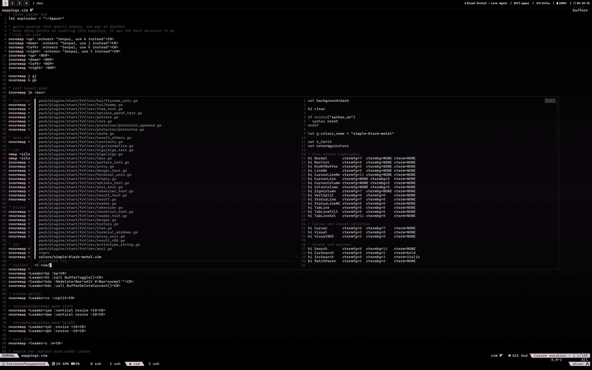
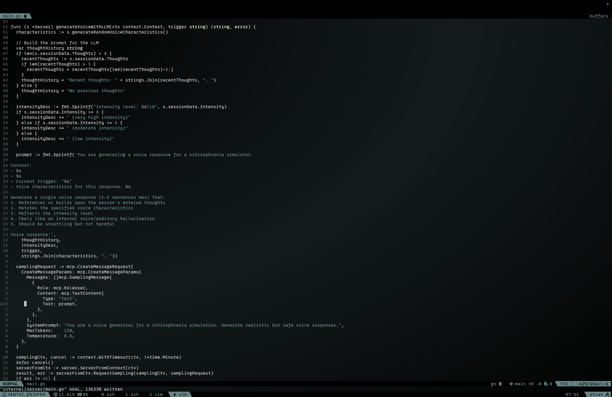

# Keta-powered Dotfiles

Welcome to my meticulously crafted dotfiles - named after my cat and optimized for pure coding joy! These configs turn your terminal into a productivity powerhouse without the bloat.

## What's Inside

A carefully curated selection of configurations for vim, tmux, zsh, and git that just work™. My vim setup is intentionally minimal - using Vim's native plugin management instead of third-party solutions because sometimes vanilla is the best flavor.

## Requirements

Before diving in, make sure you have:

- `git` - version control that powers everything
- `npm` - for CoC and other JavaScript tooling
- `fzf`, `bat`, `ripgrep`, `the_silver_searcher`, `perl`, `universal-ctags` - the fuzzy-finding dream team

Quick install of dependencies on macOS:

```bash
brew install git npm fzf bat ripgrep the_silver_searcher perl universal-ctags
```

## Installation

One command and you're flying:

```bash
curl -o- https://raw.githubusercontent.com/dorukozerr/dotfiles/main/install.sh | bash
```

What it does:

- Backs up your existing configs to `~/dotfiles_backup_<timestamp>/`
- Specifically backs up: `~/.vimrc`, `~/.vim/`, `~/.zshrc`, `~/.zprofile`, `~/.config/tmux/`, `~/.scripts/`, `~/.gitconfig`
- Sets up vim, tmux, zsh, git configurations
- Installs all necessary plugins

## Vim Plugins

My Vim setup uses a carefully curated set of plugins installed via Vim's native package management system:

### Core Functionality

- **vim-fugitive** - Git integration so seamless you'll forget it's a plugin
- **fzf & fzf.vim** - Lightning-fast fuzzy finding for files, buffers, and more
- **FastFold** - Speed optimization for code folding

### Development Tools

- **coc.nvim** - Intellisense engine for Vim, providing VSCode-like features
- **kisuke.vim** - My custom AI assistant for coding support
- **vim-jsx-pretty** - JSX syntax highlighting and indentation
- **typescript-vim** - TypeScript syntax support

### Visual Enhancements

- **vim-airline** - Lightweight yet informative status bar
- **vim-airline-themes** - Includes custom Keta theme for airline
- **vim-devicons** - Pretty icons for filetypes and directories

### CoC Extensions

CoC provides IDE-like features through these extensions:

- Language Support: coc-vimlsp, coc-sh, coc-tsserver, coc-go, coc-html, coc-css, coc-json, coc-yaml
- Frontend: @yaegassy/coc-tailwindcss3
- Tooling: coc-prettier, coc-eslint, coc-dotenv

All plugins are automatically installed during the dotfiles setup process. Run `:helptags ALL` after installation to generate help documentation.

## Important Notes

- The dotfiles contain my personal Git configuration. You **must** update `~/.gitconfig` with your own name and email before using.
- To achieve the exact look shown in the screenshots, set your terminal to use the Keta theme colors defined in the theme section below. All vim and tmux colors inherit from the terminal ANSI color definitions rather than being hardcoded.





## Keta Theme

A soft, pastel color scheme named after my cat, featuring gentle pinks and greens.

| Label          | Color Code | Preview                                           |
| :------------- | :--------- | :------------------------------------------------ |
| Background     | `#000000`  |  |
| Text           | `#FFFFFF`  |  |
| Bold Text      | `#FFFFFF`  |  |
| Cursor         | `#B56F88`  |  |
| Selection      | `#808080`  |  |
| Normal Black   | `#0A0A0A`  |  |
| Normal Red     | `#C55A5A`  |  |
| Normal Green   | `#7F6D9E`  |  |
| Normal Yellow  | `#B56F88`  |  |
| Normal Blue    | `#5E8C7A`  |  |
| Normal Magenta | `#9C6D9A`  |  |
| Normal Cyan    | `#78997C`  |  |
| Normal White   | `#F5F5F5`  |  |
| Bright Black   | `#141414`  |  |
| Bright Red     | `#D77272`  |  |
| Bright Green   | `#9989B8`  |  |
| Bright Yellow  | `#C7869E`  |  |
| Bright Blue    | `#7AAA98`  |  |
| Bright Magenta | `#B784B4`  |  |
| Bright Cyan    | `#93AF8A`  |  |
| Bright White   | `#EBEBEB`  |  |

## Vim shortcuts configured manually

- Leader key is remapped to space.

| Keys                                                      | Description                                                            | Mode    |
| :-------------------------------------------------------- | :--------------------------------------------------------------------- | :------ |
| <kbd>j</kbd> <kbd>k</kbd>                                 | Exit insert mode                                                       | `i`     |
| <kbd>leader</kbd> <kbd>s</kbd>                            | Save current buffer                                                    | `n`     |
| <kbd>j</kbd>                                              | Move down (works with wrapped lines)                                   | `n`     |
| <kbd>k</kbd>                                              | Move up (works with wrapped lines)                                     | `n`     |
| <kbd>leader</kbd> <kbd>t</kbd>                            | Open Netrw file explorer                                               | `n`     |
| <kbd>leader</kbd> <kbd>p</kbd>                            | Find files (FZF)                                                       | `n`     |
| <kbd>leader</kbd> <kbd>f</kbd>                            | Find in files (Ripgrep)                                                | `n`     |
| <kbd>leader</kbd> <kbd>b</kbd> <kbd>n</kbd>               | Next buffer                                                            | `n`     |
| <kbd>leader</kbd> <kbd>b</kbd> <kbd>p</kbd>               | Previous buffer                                                        | `n`     |
| <kbd>leader</kbd> <kbd>b</kbd> <kbd>c</kbd>               | Close all buffers except current                                       | `n`     |
| <kbd>leader</kbd> <kbd>b</kbd> <kbd>t</kbd>               | Buffer maximize toggle                                                 | `n`     |
| <kbd>leader</kbd> <kbd>i</kbd> <kbd>p</kbd> <kbd>w</kbd>  | Increase pane width (+10)                                              | `n`     |
| <kbd>leader</kbd> <kbd>d</kbd> <kbd>p</kbd> <kbd>w</kbd>  | Decrease pane width (-10)                                              | `n`     |
| <kbd>leader</kbd> <kbd>i</kbd> <kbd>p</kbd> <kbd>h</kbd>  | Increase pane height (+10)                                             | `n`     |
| <kbd>leader</kbd> <kbd>d</kbd> <kbd>p</kbd> <kbd>h</kbd>  | Decrease pane height (-10)                                             | `n`     |
| <kbd>leader</kbd> <kbd>g</kbd> <kbd>s</kbd>               | Git status                                                             | `n`     |
| <kbd>leader</kbd> <kbd>g</kbd> <kbd>a</kbd>               | Git add all                                                            | `n`     |
| <kbd>leader</kbd> <kbd>g</kbd> <kbd>c</kbd>               | Git commit (vertical split)                                            | `n`     |
| <kbd>leader</kbd> <kbd>g</kbd> <kbd>p</kbd>               | Git push                                                               | `n`     |
| <kbd>leader</kbd> <kbd>g</kbd> <kbd>d</kbd>               | Git diff (vertical split)                                              | `n`     |
| <kbd>leader</kbd> <kbd>g</kbd> <kbd>l</kbd>               | Git log (vertical split)                                               | `n`     |
| <kbd>g</kbd> <kbd>d</kbd>                                 | Go to definition                                                       | `n`     |
| <kbd>g</kbd> <kbd>t</kbd>                                 | Go to type definition                                                  | `n`     |
| <kbd>ctrl</kbd> <kbd>j</kbd>                              | Trigger completion                                                     | `i`     |
| <kbd>ctrl</kbd> <kbd>k</kbd> <kbd>ctrl</kbd> <kbd>i</kbd> | Show documentation                                                     | `n/i`   |
| <kbd>ctrl</kbd> <kbd>f</kbd>                              | Scroll down in floating window                                         | `n/i/v` |
| <kbd>ctrl</kbd> <kbd>b</kbd>                              | Scroll up in floating window                                           | `n/i/v` |
| <kbd>leader</kbd> <kbd>c</kbd> <kbd>d</kbd>               | Copy definition                                                        | `n`     |
| <kbd>leader</kbd> <kbd>k</kbd> <kbd>o</kbd>               | Open Kisuke                                                            | `n`     |
| <kbd>leader</kbd> <kbd>k</kbd> <kbd>r</kbd> <kbd>s</kbd>  | Resume last Kisuke session                                             | `n`     |
| <kbd>leader</kbd> <kbd>k</kbd> <kbd>m</kbd>               | Mark focused file for Kisuke                                           | `n`     |
| <kbd>leader</kbd> <kbd>k</kbd> <kbd>h</kbd>               | Mark highlighted text for Kisuke                                       | `v`     |
| <kbd>leader</kbd> <kbd>k</kbd> <kbd>r</kbd> <kbd>c</kbd>  | Remove last marked code block                                          | `n`     |
| <kbd>leader</kbd> <kbd>k</kbd> <kbd>c</kbd>               | Create new Kisuke session                                              | `n`     |
| <kbd>leader</kbd> <kbd>k</kbd> <kbd>d</kbd>               | Delete Kisuke session                                                  | `n`     |
| <kbd>leader</kbd> <kbd>w</kbd> <kbd>r</kbd>               | Search and replace word under cursor with entered value                | `n`     |
| <kbd>leader</kbd> <kbd>p</kbd> <kbd>r</kbd>               | Search and replace entered value to highlighted pattern in visual mode | `v`     |
| <kbd>leader</kbd> <kbd>p</kbd> <kbd>a</kbd>               | Search and append entered value to highlighted pattern in visual mode  | `v`     |
