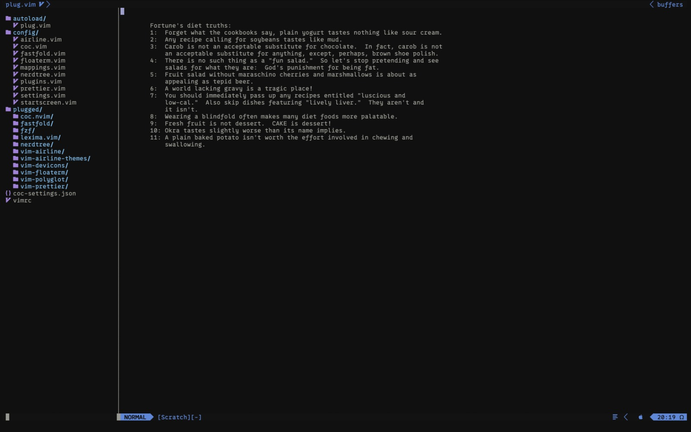

# My little vim setup

-   You need fortune to use this setup. Install it or remove `startscreen.vim` from `vimrc` file.
-   To use my vim config fallow these instructions. First run `git clone https://github.com/dorukozerr/my-vim-config.git ~/.vim && curl -fLo ~/.vim/autoload/plug.vim --create-dirs https://raw.githubusercontent.com/junegunn/vim-plug/master/plug.vim && rm -rf ~/.vim/.git`.
-   Then enter vim and type `:PlugInstall`.
-   Then in terminal run `cd ~/.vim/plugged/coc.nvim && npm ci && cd ~` after this, you can run `:CocInstall coc-tsserver coc-eslint coc-vimlsp coc-json coc-css @yaegassy/coc-tailwindcss3` in vim to install my default coc extensions.
-   I'm using wryan theme on macos terminal app. Colors are setted to t_Co=16 in my settings. You can import `wryan.terminal` file to use my theme if you want.
-   I also created a custom airline theme to match my terminal theme. It's already configured in my airline settings file, to use it just run this command `mv ~/.vim/wryan.vim ~/.vim/plugged/vim-airline-themes/autoload/airline/themes`. I think it looks nice. Or you can just change the airline theme in `~/.vim/config/airline.vim` to `let g:airline_theme='minimalist`.

And thats my vim setup.

Dont forget to remove `.git` `.gitignore` `README.md` `wryan.vim` `vim-screenshot.jpeg` `vimShortcuts.txt` from `~/.vim` folder after clone, thoose files should not be in the folder.

I created this repo to install my config on my other machines easily, also record the changes of my config.

