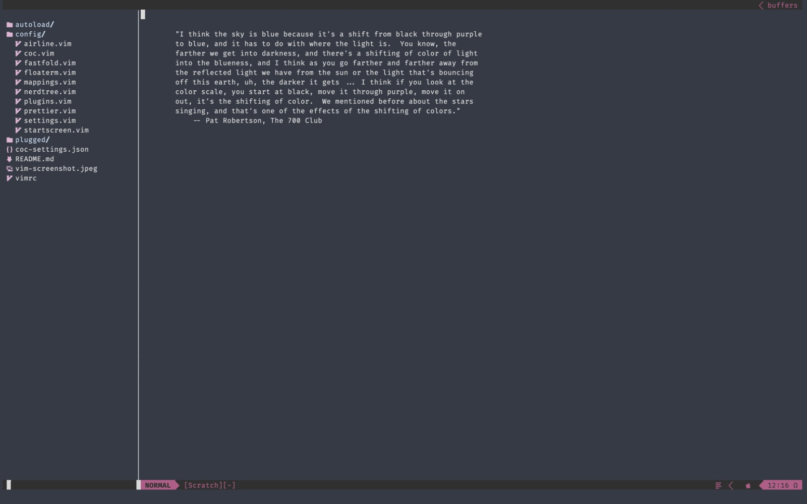
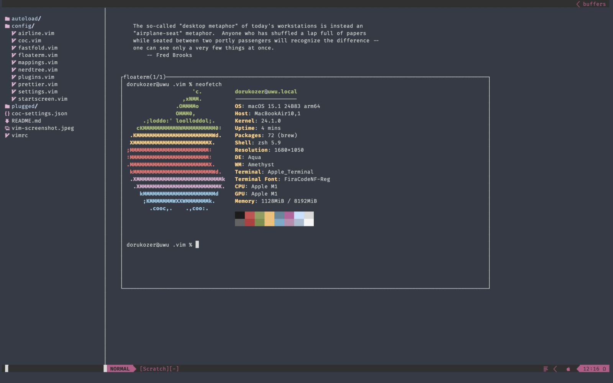
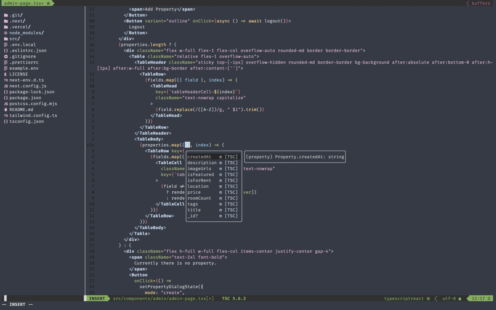

# My little vim setup

-   You need fortune to use this setup. Install it or remove `startscreen.vim` from `vimrc` file, and delete file from `~/.vim/config` folder.
-   To use my vim config fallow these instructions. First run `git clone https://github.com/dorukozerr/my-vim-config.git ~/.vim && curl -fLo ~/.vim/autoload/plug.vim --create-dirs https://raw.githubusercontent.com/junegunn/vim-plug/master/plug.vim && rm -rf ~/.vim/.git ~/.vim/.gitignore`.
-   Then enter vim and type `:PlugInstall`.
-   Run `:CocInstall coc-tsserver coc-eslint coc-vimlsp coc-json coc-css @yaegassy/coc-tailwindcss3 coc-go` in vim to install my most used coc extensions for web dev.
-   I also created a custom airline theme to match my terminal theme. It's already configured in my airline settings file, to use it just run this command `mv ~/.vim/relaxed.vim ~/.vim/plugged/vim-airline-themes/autoload/airline/themes`. I think it looks nice. Or you can just change the airline theme in `~/.vim/config/airline.vim` to `let g:airline_theme='minimalist`.
-   I use this [terminal theme](https://github.com/lysyi3m/macos-terminal-themes/blob/master/themes/Relaxed.terminal).

### And thats my vim setup.

-   I created this repo to install my config on my other machines easily, also record the changes of my config.
-   Run this command after installation, theese files somehow slows down or even breaks vim when they are present in .vim folder `rm -rf ~/.vim/README.md ~/.vim/vim-ss-1.jpeg ~/.vim/vim-ss-2.jpeg ~/.vim/vim-ss-3.jpeg ~/.vim/relaxed.vim`. Or it was .git repo folder breaked vim when it happened to me. I did not test which files or folders caused that problem. But removing everything thats not related to vim configuration fixed it.

-   [x] Create a repo for simple installation
-   [x] Document every shortcut that custom configured
-   [ ] Find a way the hide or conceal contents of .env files when opening them
-   [ ] Customize startscreen.vim script
-   [x] Markdown is fun

###   Shortcuts I added manually

-   Leader key is remapped to space.

| Keys                                                      | Description                           | Mode |
| :-------------------------------------------------------- | :------------------------------------ | :--- |
| <kbd>ctrl</kbd> <kbd>j</kbd>                              | Open coc autocomplete suggestionsc    | `i`  |
| <kbd>ctrl</kbd> <kbd>k</kbd> <kbd>ctrl</kbd> <kbd>i</kbd> | Coc do hover                          | `ì`  |
| <kbd>ctrl</kbd> <kbd>k</kbd> <kbd>ctrl</kbd> <kbd>i</kbd> | Coc do hover                          | `n`  |
| <kbd>g</kbd> <kbd>d</kbd>                                 | Coc open definition in split          | `n`  |
| <kbd>g</kbd> <kbd>t</kbd>                                 | Coc open type definition in split     | `n`  |
| <kbd>ctrl</kbd> <kbd>t</kbd>                              | Toggle NERDTREE                       | `n`  |
| <kbd>ctrl</kbd> <kbd>p</kbd>                              | Open fzf                              | `n`  |
| <kbd>leader</kbd> <kbd>b</kbd> <kbd>n</kbd>               | Go to next buffer (buffer next)       | `n`  |
| <kbd>leader</kbd> <kbd>b</kbd> <kbd>p</kbd>               | Go to prev buffer (buffer prev)       | `n`  |
| <kbd>leader</kbd> <kbd>i</kbd> <kbd>w</kbd> <kbd>w</kbd>  | Increase window width                 | `n`  |
| <kbd>leader</kbd> <kbd>d</kbd> <kbd>w</kbd> <kbd>w</kbd>  | Decrease window width                 | `n`  |
| <kbd>leader</kbd> <kbd>i</kbd> <kbd>w</kbd> <kbd>h</kbd>  | Increase window height                | `n`  |
| <kbd>leader</kbd> <kbd>d</kbd> <kbd>w</kbd> <kbd>h</kbd>  | Decrease window heigh                 | `n`  |
| <kbd>leader</kbd> <kbd>f</kbd> <kbd>t</kbd>               | Toggle floating terminal              | `n`  |
| <kbd>leader</kbd> <kbd>f</kbd> <kbd>c</kbd>               | Create floating terminal instance     | `n`  |
| <kbd>leader</kbd> <kbd>f</kbd> <kbd>n</kbd>               | Go to next floating terminal instance | `n`  |
| <kbd>leader</kbd> <kbd>f</kbd> <kbd>p</kbd>               | Go to prev floating terminal instance | `n`  |
| <kbd>leader</kbd> <kbd>f</kbd> <kbd>q</kbd>               | Quit/Close floating terminal          | `n`  |
