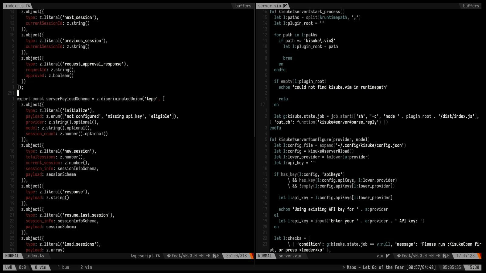
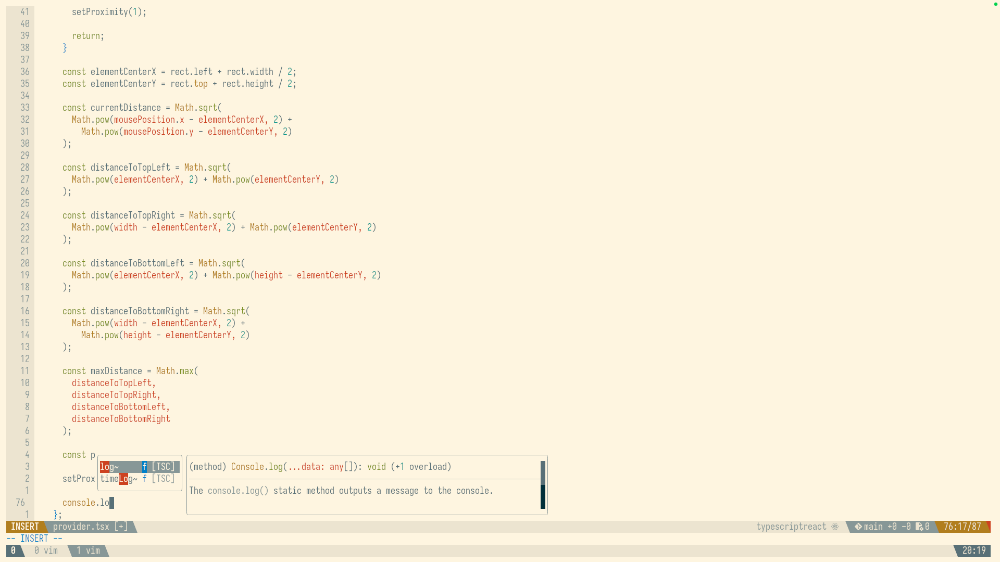

# My dotfiles

- Install script will backup your `~/.vimrc`, `~/.vim/`, `~/.zshrc`, `~/.config/tmux/`, `~/.scripts/`, `~/.gitconfig` files and folders to `~/dotfiles_backup_<timestamp>/` folder and installs my settings. I did this to install my environment but you can use also if you want >.<
- I only did this on macos I don't know if it is compatible with other OS's, but it should be compatible with linux I guess but I didn't tested it.
- My cli based [todo app](https://github.com/dorukozerr/todo-app) being used in zshrc file. Either install it or remove that part from zshrc.
- I tried to keep my vim configuration minimal as possible, instead of third party plugin managers like Vundle or vim-plug I used Vim's native solution. I also created a script to update vim plugins feel free to check it out.
- FZF plugin has some dependencies to install them run `brew install fzf bat ripgrep the_silver_searcher perl universal-ctags`.

## Vim Plugins

- [vim-fugite](https://github.com/tpope/vim-fugitive)
- [fzf](https://github.com/junegunn/fzf)
- [fzf.vim](https://github.com/junegunn/fzf.vim)
- [coc.nvim](https://github.com/neoclide/coc.nvim)

### CoC Extensions

#### Language Support

- [coc-vimlsp](https://www.npmjs.com/package/coc-vimlsp)
- [coc-sh](https://www.npmjs.com/package/coc-sh)
- [coc-tsserver](https://www.npmjs.com/package/coc-tsserver)
- [coc-go](https://www.npmjs.com/package/coc-go)
- [coc-html](https://www.npmjs.com/package/coc-html)
- [coc-css](https://www.npmjs.com/package/coc-css)
- [@yaegassy/coc-tailwindcss3](https://www.npmjs.com/package/@yaegassy/coc-tailwindcss3)
- [coc-json](https://www.npmjs.com/package/coc-json)
- [coc-yaml](https://www.npmjs.com/package/coc-yaml)

#### Tools and Formatting

- [coc-prettier](https://www.npmjs.com/package/coc-prettier)
- [coc-eslint](https://www.npmjs.com/package/coc-eslint)
- [coc-dotenv](https://www.npmjs.com/package/coc-dotenv)

## Installation Script

```bash
curl -o- https://raw.githubusercontent.com/dorukozerr/dotfiles/main/install.sh &> /dev/null | bash
```

### Note

- Run `:helptags ALL` to sync vim help command with installed plugins and extensions.




## Vim shortcuts configured manually

- Leader key is remapped to space.

| Keys                                                      | Description                         | Mode |
| :-------------------------------------------------------- | :---------------------------------- | :--- |
| <kbd>ctrl</kbd> <kbd>j</kbd>                              | Open coc autocomplete suggestions   | `i`  |
| <kbd>ctrl</kbd> <kbd>k</kbd> <kbd>ctrl</kbd> <kbd>i</kbd> | Coc do hover                        | `ì`  |
| <kbd>j</kbd> <kbd>k</kbd>                                 | Exit insert mode                    | `i`  |
| <kbd>ctrl</kbd> <kbd>k</kbd> <kbd>ctrl</kbd> <kbd>i</kbd> | Coc do hover                        | `n`  |
| <kbd>g</kbd> <kbd>d</kbd>                                 | Coc open definition in split        | `n`  |
| <kbd>g</kbd> <kbd>t</kbd>                                 | Coc open type definition in split   | `n`  |
| <kbd>ctrl</kbd> <kbd>f</kbd>                              | Scroll down on coc floating window  | `n`  |
| <kbd>ctrl</kbd> <kbd>b</kbd>                              | Scroll up on coc floating window    | `n`  |
| <kbd>ctrl</kbd> <kbd>f</kbd>                              | Scroll down on coc floating window  | `i`  |
| <kbd>ctrl</kbd> <kbd>b</kbd>                              | Scroll up on coc floating window    | `i`  |
| <kbd>ctrl</kbd> <kbd>f</kbd>                              | Scroll down on coc floating window  | `v`  |
| <kbd>ctrl</kbd> <kbd>b</kbd>                              | Scroll up on coc floating window    | `v`  |
| <kbd>leader</kbd> <kbd>t</kbd>                            | Open Netrw                          | `n`  |
| <kbd>leader</kbd> <kbd>p</kbd>                            | Fzf file search                     | `n`  |
| <kbd>leader</kbd> <kbd>f</kbd>                            | Fzf grep search                     | `n`  |
| <kbd>leader</kbd> <kbd>b</kbd> <kbd>n</kbd>               | Go to next buffer (buffer next)     | `n`  |
| <kbd>leader</kbd> <kbd>b</kbd> <kbd>p</kbd>               | Go to prev buffer (buffer prev)     | `n`  |
| <kbd>leader</kbd> <kbd>b</kbd> <kbd>c</kbd>               | Close all buffers except active one | `n`  |
| <kbd>leader</kbd> <kbd>i</kbd> <kbd>p</kbd> <kbd>w</kbd>  | Increase pane width                 | `n`  |
| <kbd>leader</kbd> <kbd>d</kbd> <kbd>p</kbd> <kbd>w</kbd>  | Decrease pane width                 | `n`  |
| <kbd>leader</kbd> <kbd>i</kbd> <kbd>p</kbd> <kbd>h</kbd>  | Increase pane height                | `n`  |
| <kbd>leader</kbd> <kbd>d</kbd> <kbd>p</kbd> <kbd>h</kbd>  | Decrease pane height                | `n`  |
| <kbd>leader</kbd> <kbd>s</kbd>                            | Save buffer                         | `n`  |

## Keta Theme

A soft, pastel color scheme named after my cat, featuring gentle pinks and greens.

| Label          | Color Code | Preview                                           |
| :------------- | :--------- | :------------------------------------------------ |
| Background     | `#030303`  |  |
| Text           | `#E6DDE1`  |  |
| Bold Text      | `#F7F0F3`  |  |
| Cursor         | `#96B8B6`  |  |
| Selection      | `#2D3747`  |  |
| Normal Black   | `#121212`  |  |
| Normal Red     | `#D48C8C`  |  |
| Normal Green   | `#B5A7C4`  |  |
| Normal Yellow  | `#C38EA1`  |  |
| Normal Blue    | `#96B0A4`  |  |
| Normal Magenta | `#C19DBD`  |  |
| Normal Cyan    | `#B1C0AB`  |  |
| Normal White   | `#EAEAEA`  |  |
| Bright Black   | `#2A2A2A`  |  |
| Bright Red     | `#E9A3A3`  |  |
| Bright Green   | `#CFBDE3`  |  |
| Bright Yellow  | `#DCAEC1`  |  |
| Bright Blue    | `#B0CDC3`  |  |
| Bright Magenta | `#D9B2D6`  |  |
| Bright Cyan    | `#C9D8C3`  |  |
| Bright White   | `#FFFFFF`  |  |
